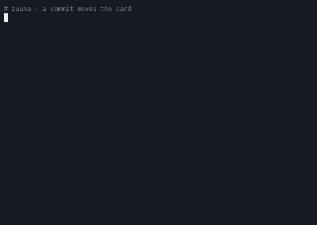
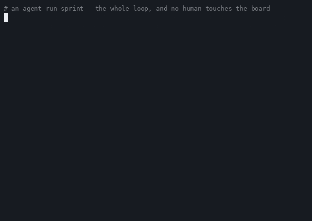

# Demo: a commit moves the card



`zuuna-demo.gif` / `zuuna-demo.cast` — recorded 2026-09-18, what you see is what
happened: the real `zuuna` CLI, no mocks, against a **staging** Zuuna workspace
(so no production board is touched by a demo). The API token used is a stage
token; it stays in the recording shell's environment and is never printed —
every command that would carry it is shown with the `$VARIABLE` unexpanded.

## What the 30 seconds show

1. `curl -o zuuna https://app.zuuna.de/zuuna.sh` — the whole install.
2. `./zuuna init "$ZUUNA_URL" "$ZUUNA_TOKEN"` — writes `.git/zuuna.conf` and the post-commit hook.
3. `git commit -m "QUI-3: first commit from a fresh clone"` — the hook is silent on success, by design.
4. The card API is polled before and after: `QUI-3` moved from `To do` to `In Progress`.

The move itself is the board's automation rule ("A commit is linked" → "move to
column"); linking happens out of the box, movement is one rule you opt into.
Both are covered in the [main README](../README.md).

## Reproduce it

```bash
git init my-project && cd my-project
curl -o zuuna https://app.zuuna.de/zuuna.sh && chmod +x zuuna
./zuuna init https://app.zuuna.de zk_live_your-token-from-developers-page
echo "# demo" > README.md && git add -A
git commit -m "YOUR-1: first commit from a fresh clone"
```

...then look at the card `YOUR-1` on your board.

## How the recording was made

The session was scripted line by line (the commands shown are the commands run;
a small driver prints the `$` prompt lines and captions), then recorded and
converted:

```bash
asciinema rec --idle-time-limit 1.2 -t "zuuna: a commit moves the card" zuuna-demo.cast
agg --font-size 13 --theme github-dark --speed 1.4 zuuna-demo.cast zuuna-demo.gif
```

`driver.sh` is the exact driver used; it needs `ZUUNA_URL` and `ZUUNA_TOKEN`
exported and a card in the `To do` column whose key appears in the commit line.

---

## The agent-run demo: an agent works the board, git keeps it honest



`agent-run.gif` / `agent-run.cast` — recorded 2026-09-22, session starring
**ZCode agent (GLM)**. Everything on screen is a real tool call and a real
commit, run against this public repository and the **public demo board**
([app.zuuna.de/demo](https://app.zuuna.de/demo), read-only for everyone):

1. A real MCP client session opens the published [`mcp-server-zuuna`](https://www.npmjs.com/package/mcp-server-zuuna)
   (stdio): initialize, `tools/list`, `zuuna_me`.
2. The agent picks up card `CLI-3` (shipped the previous sprint) and continues
   work on it: one line in the README, pointing at the very recording being made.
3. The commit is pushed, the PR is opened and merged — and nobody touches the
   board. The board's own git-truth automations do the moving: the push moved
   `CLI-3` to *In Progress*, the merge closed it back to *Done*.

One honest footnote: the MCP step shows the server handshake, the tool list and
the token identity. The demo board lives in its own demo org (API tokens are
org-scoped and the demo org seeds none by design), so the board reads on screen
come from the public `/demo` page itself — the same view any visitor gets.

`agent-run-driver.sh` is the exact driver of the recording; the two helper
scripts and the MCP client it runs are in this directory. It needs
`ZUUNA_API_TOKEN` exported and `gh` authenticated. Commands are shown exactly
as executed. Regenerate the GIF with:

```bash
asciinema rec --idle-time-limit 1.2 agent-run.cast -c "bash demo/agent-run-driver.sh"
agg --font-size 13 --theme github-dark --speed 2 agent-run.cast agent-run.gif
```
